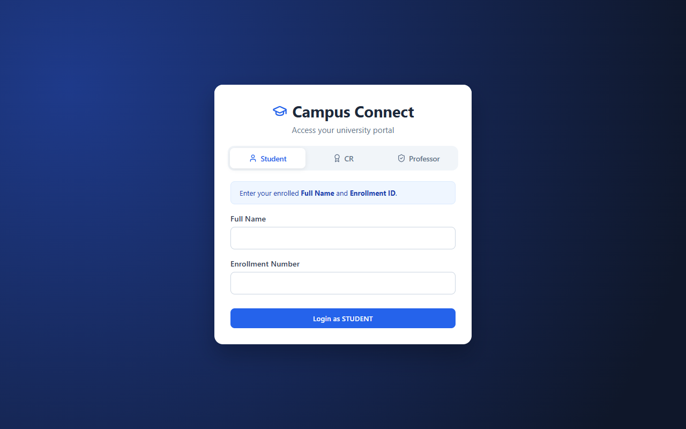
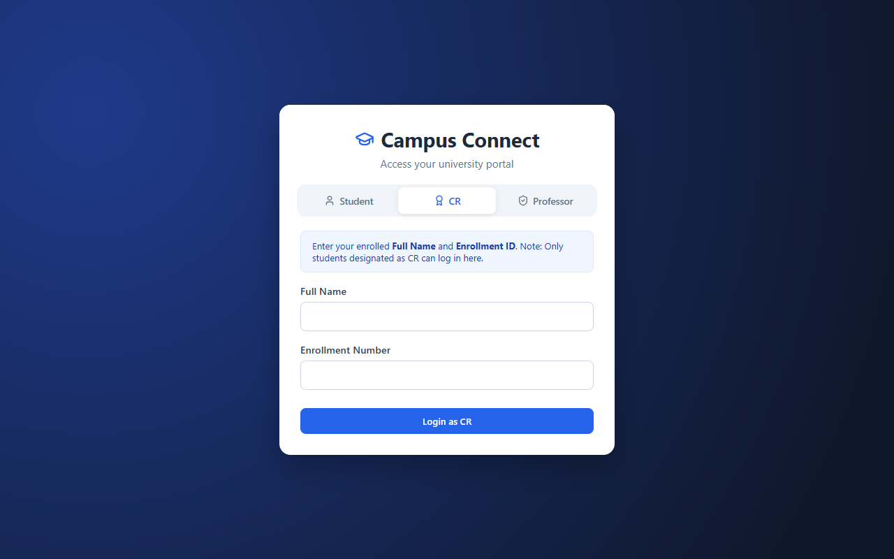
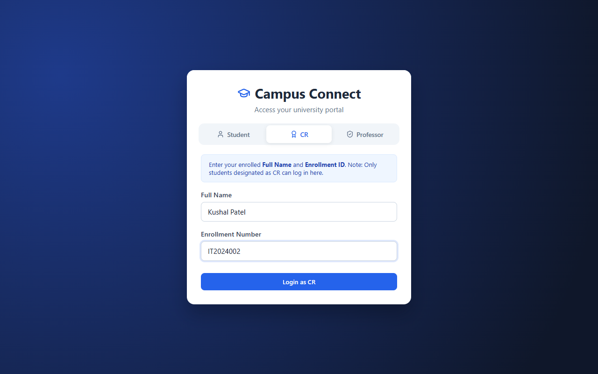
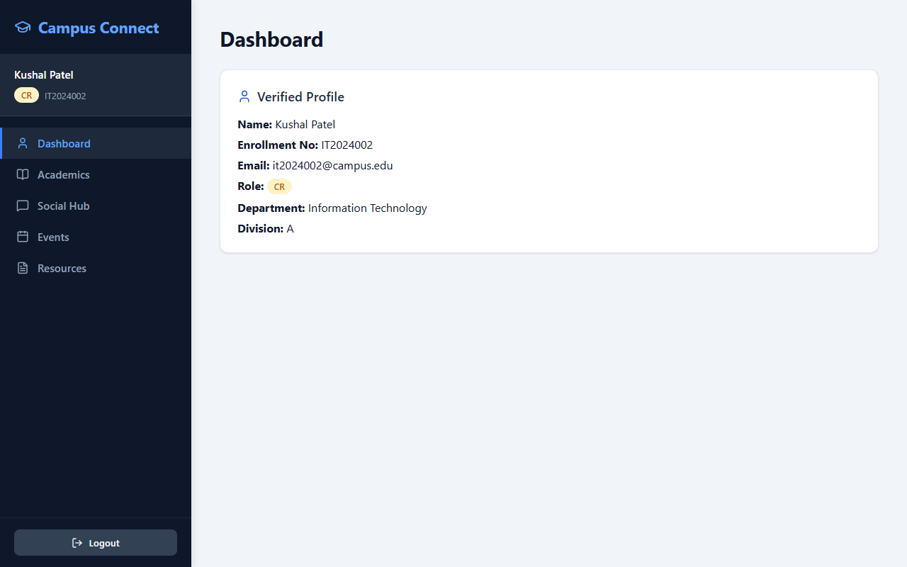
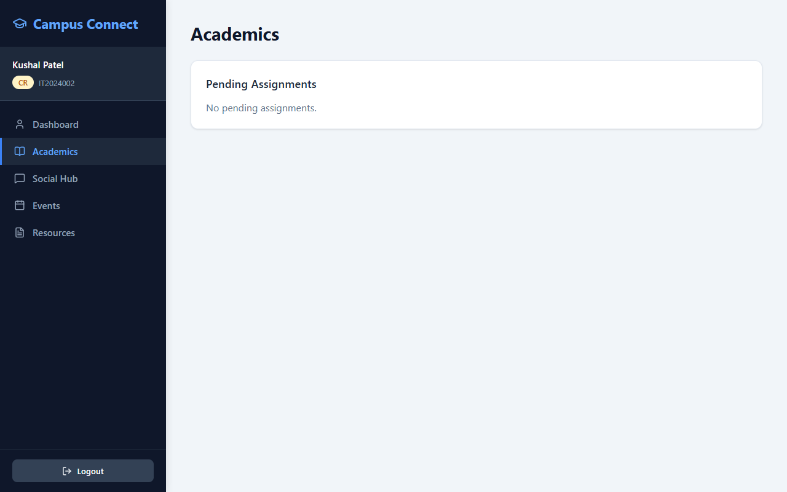
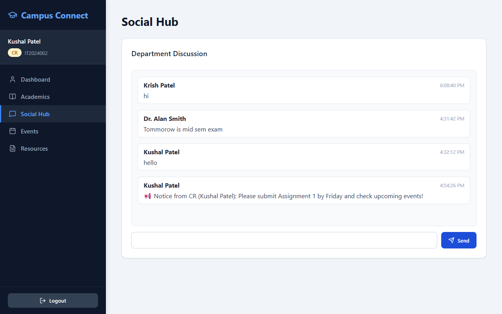
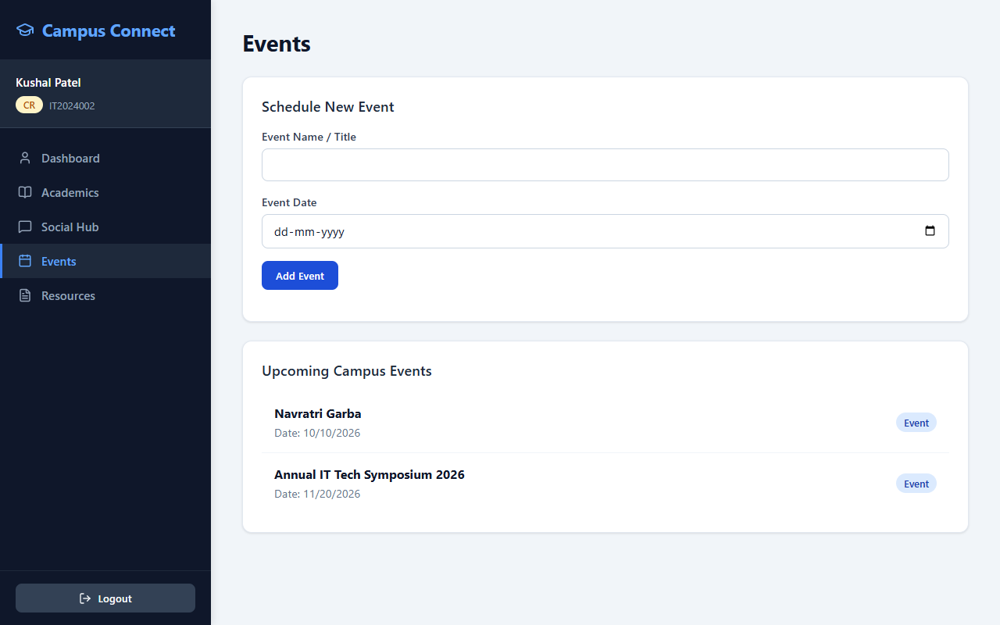
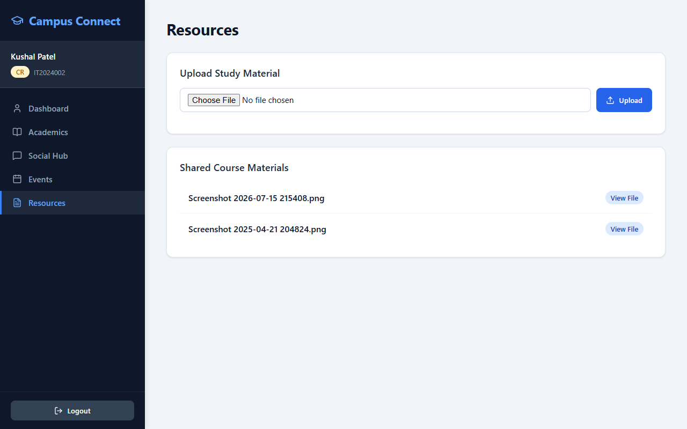
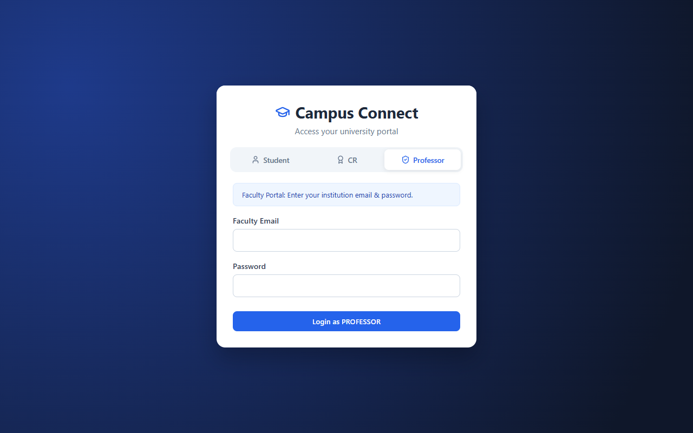

# Campus Connect — System Functionality & Demonstration Report

**User / Session:** Kushal Patel  
**Designated Role:** Class Representative (CR)  
**Enrollment ID:** `IT2024002`  
**Department / Division:** Information Technology — Div A  
**Application URL:** `http://localhost:5173`  
**API Endpoint:** `http://localhost:5000/api`  
**Screenshots Folder:** `report_screenshots/`

---

## 1. Authentication & Role Selection Portal

The authentication module features a multi-role selector accommodating **Students**, **Class Representatives (CR)**, and **Professors**.

### 1.1 Student Login Screen
Students authenticate using their registered **Full Name** and **Enrollment ID**.

---

### 1.2 Class Representative (CR) Selection & Login
Selecting the **CR** tab restricts authentication strictly to students with active CR privileges in the institutional database.

---

### 1.3 CR Credentials Entered (`Kushal Patel` - `IT2024002`)
Inputting CR **Kushal Patel** (`IT2024002`) credentials before hitting **Login as CR**.

---

## 2. Authenticated Class Representative (CR) Pages

### 2.1 CR Dashboard & Verified Profile
Upon successful verification, the dashboard presents the verified institutional identity along with role, email (`it2024002@campus.edu`), department, and division badges.

- **User Profile Indicator:** Displays CR badge and enrollment ID on top of the left navigation rail.
- **Verification Details:** Confirms active Class Representative credentials for IT Division A.

---

### 2.2 Academics Portal
Provides students and representatives access to assignments and deadlines posted by faculty members.

- **Pending Tasks & Deadlines:** Real-time synchronization of academic coursework.

---

### 2.3 Social Hub & Real-time Department Discussions
An interactive collaborative channel for peer-to-peer and class-wide announcements.

- **Demonstrated Functionality:** Posted live announcement as CR **Kushal Patel**:  
  `"📢 Notice from CR (Kushal Patel): Please submit Assignment 1 by Friday and check upcoming events!"`
- **Sender Tracking:** Highlights author name and real-time timestamp for clear audit trails.

---

### 2.4 Events Management & CR Scheduling
Class Representatives and Faculty possess elevated permissions to publish university and division events directly to the campus timeline.

- **Demonstrated Functionality:** Successfully scheduled a new event:
  - **Event Title:** `Annual IT Tech Symposium 2026`
  - **Date:** `20/11/2026`
- **Dynamic Updates:** Automatically rendered in the "Upcoming Campus Events" list alongside existing functions like `Navratri Garba`.

---

### 2.5 Resources & Study Materials Portal
A shared repository facilitating document exchange and academic downloads.

- **Upload Study Material:** Allows uploading course notes, previous papers, and presentation slide decks.
- **Shared Documents:** Enables downloading and previewing uploaded resources directly.

---

### 2.6 Faculty Portal Tab (Overview)
For report completeness, the dedicated Faculty / Professor login gateway is highlighted:

---

## 3. Summary of Captured Pages & Functionalities

| # | Page / Feature | User Role Demonstrated | Key Functionality Highlighted | Screenshot File |
|---|----------------|-----------------------|-------------------------------|-----------------|
| 1 | Student Login | Student | Name & Enrollment ID verification | `01_login_student_tab.png` |
| 2 | CR Login Tab | Class Representative | Restricted CR role selection | `02_login_cr_tab.png` |
| 3 | CR Credentials | Kushal Patel (`IT2024002`) | Input credentials validation | `03_login_cr_filled.png` |
| 4 | Dashboard | Kushal Patel (CR) | Verified user profile details & badges | `04_dashboard_cr.png` |
| 5 | Academics | Kushal Patel (CR) | Course assignments & tracking | `05_academics.png` |
| 6 | Social Hub | Kushal Patel (CR) | Posted broadcast announcement in chat | `07_social_hub_posted.png` |
| 7 | Events | Kushal Patel (CR) | Scheduled `Annual IT Tech Symposium 2026` | `09_events_scheduled.png` |
| 8 | Resources | Kushal Patel (CR) | Shared course materials & uploads | `10_resources.png` |
| 9 | Faculty Portal | Professor | Institutional email & password portal | `11_login_professor_tab.png` |

---
*Report generated for Kushal Patel — Campus Connect System Documentation.*
